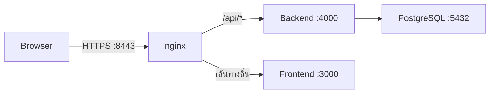

# 📋 ROPA

ระบบบันทึกและบริหารจัดการ **Record of Processing Activities** สำหรับติดตั้งใช้งานเอง (self-hosted) ตามแนวทาง GDPR มาตรา 30 และ PDPA ของไทย

รองรับการแบ่งข้อมูลตามหน่วยงาน ขั้นตอนอนุมัติ การกำหนดสิทธิ์ 2FA ไฟล์แนบ การแจ้งเตือน การสำรองข้อมูลอัตโนมัติ และ 3 ภาษา: ไทย อังกฤษ และจีน

## ✨ ภาพรวม

- 🏢 บริหารรายการ ROPA แยกตามหน่วยงาน
- 🔄 ส่งรายการเพื่ออนุมัติ ตีกลับ และแก้ไขใหม่ได้
- 🔐 ปรับบทบาทและสิทธิ์จากหน้าเว็บผ่าน Permission Matrix
- 🔒 บังคับใช้ 2FA และ HTTPS กับทุกบัญชี
- 📎 แนบไฟล์ ส่งออก Excel/PDF และตรวจสอบ Audit Log ได้
- 💾 สำรองข้อมูลอัตโนมัติทุกคืน

## 🚀 เริ่มต้นใช้งาน

### 1. ⚙️ เตรียมไฟล์ตั้งค่า

```bash
cp .env.example .env
```

สร้าง secret แล้วนำค่าไปกำหนดใน `.env` ตามคำอธิบายภายในไฟล์:

```bash
# ใช้สร้าง ACCESS_TOKEN_SECRET และ PRE_AUTH_TOKEN_SECRET
openssl rand -hex 32

# ใช้สร้าง TOTP_ENCRYPTION_KEY (64 ตัวอักษร hex / 32 bytes)
openssl rand -hex 32
```

### 2. 🐳 เริ่มระบบด้วย Docker Compose

```bash
docker compose pull
docker compose up -d --build --wait
```

Apple Container ใช้คำสั่งต่อไปนี้แทน (ต้องติดตั้ง `container-compose`):

```bash
container-compose --file docker-compose.yml build
container-compose --file docker-compose.yml up -d --env-file .env
container list --all
```

### 3. 🌐 เปิดหน้าเว็บ

เปิด [https://localhost:8443](https://localhost:8443) หรือพอร์ตที่กำหนดใน `PUBLIC_HTTPS_PORT`

ระบบสร้างใบรับรองแบบ self-signed ให้อัตโนมัติในการรันครั้งแรก เบราว์เซอร์จึงอาจแสดงคำเตือน สำหรับระบบที่เปิดใช้งานผ่านอินเทอร์เน็ตควรเปลี่ยนเป็นใบรับรองจาก CA เช่น Let's Encrypt

## 🔐 บัญชีเริ่มต้นและ 2FA

บัญชีผู้ดูแลระบบเริ่มต้นกำหนดได้ใน `.env` โดยมีค่าเริ่มต้นดังนี้:

| รายการ | ค่าเริ่มต้น |
|---|---|
| 📧 อีเมล | `admin@ropa.local` |
| 🔑 รหัสผ่าน | `ChangeMe123!` |

> ⚠️ **สำคัญ:** เปลี่ยนรหัสผ่านผู้ดูแลระบบทันทีหลังเข้าสู่ระบบครั้งแรก

ทุกบัญชีต้องเปิดใช้ TOTP ซึ่งรองรับแอปอย่าง Google Authenticator และ Authy ผู้ใช้ที่ยังไม่ตั้งค่าจะถูกนำไปสแกน QR หลังกรอกรหัสผ่านถูกต้อง

- รหัสลับ TOTP เข้ารหัสด้วย AES-256-GCM ก่อนจัดเก็บ
- รหัสสำรองมี 10 ชุด แต่ละชุดใช้ได้ครั้งเดียว แสดงเพียงครั้งเดียว และจัดเก็บเป็น Bcrypt Hash
- สร้างรหัสสำรองชุดใหม่ได้จากหน้าโปรไฟล์ โดยชุดเดิมจะถูกยกเลิกทันที
- การล็อกอินและยืนยันโค้ดมี Rate Limit เพื่อป้องกันการเดารหัส
- ผู้มีสิทธิ์ `users.manage` สามารถรีเซ็ต 2FA ให้ผู้ใช้ตั้งค่าใหม่ในการเข้าสู่ระบบครั้งถัดไป

<details>
<summary>ข้อมูลที่ระบบสร้างให้อัตโนมัติในการรันครั้งแรก</summary>

- Migration และ Seed ของฐานข้อมูล
- สิทธิ์และบทบาทเริ่มต้น
- หน่วยงานสำนักงานส่วนกลาง, IT และ HR
- บัญชีผู้ดูแลระบบเริ่มต้น (Bootstrap Admin)

หน่วยงานทั้งหมดเพิ่มหรือแก้ไขภายหลังได้จากหน้า **หน่วยงาน**

</details>

## 👥 บทบาท สิทธิ์ และขั้นตอน ROPA

### บทบาทเริ่มต้น

| บทบาท | สิทธิ์โดยสรุป |
|---|---|
| 👑 Super Admin | จัดการทุกส่วนของระบบ |
| 🛡️ DPO | ดูและแก้ไข ROPA ทุกหน่วยงาน อนุมัติ ตีกลับ และดูประวัติการใช้งาน |
| ✍️ Department Editor | สร้าง แก้ไข และส่ง ROPA ของหน่วยงานตนเองเพื่อขออนุมัติ |
| 👁️ Viewer / Auditor | ดู ROPA ทุกหน่วยงานและประวัติการใช้งานแบบอ่านอย่างเดียว |

สร้างบทบาทใหม่หรือแก้ไขสิทธิ์ได้จากหน้า **บทบาทและสิทธิ์** โดยไม่ต้องแก้โค้ด

### 🔑 Permission Matrix

สิทธิ์อยู่ในรูปแบบ `module.action` เช่น `ropa.read_own`, `ropa.read_all`, `ropa.approve` และ `users.manage` โดยผูกกับบทบาทผ่านตาราง `role_permissions`

ผู้ใช้มีหนึ่งบทบาทและอาจสังกัดหน่วยงาน สิทธิ์ที่ลงท้ายด้วย `_own` จำกัดข้อมูลเฉพาะหน่วยงานของผู้ใช้ ส่วน `_all` ครอบคลุมทุกหน่วยงาน

รายการสิทธิ์และบทบาทเริ่มต้นอยู่ที่ `backend/src/constants/permissions.ts`

### 🔄 ขั้นตอนการอนุมัติ

```text
แบบร่าง (DRAFT) → รออนุมัติ (SUBMITTED) → อนุมัติแล้ว (APPROVED)
                              └──────→ ตีกลับ (REJECTED) → แก้ไขใหม่
```

Department Editor เป็นผู้สร้าง แก้ไข และส่งรายการ ส่วนผู้มีสิทธิ์ `ropa.approve` เช่น DPO เป็นผู้อนุมัติหรือตีกลับพร้อมเหตุผล

ระบบบันทึกทุกการกระทำลง Audit Log พร้อมแสดงค่าก่อนและหลังของแต่ละฟิลด์ ผู้มีสิทธิ์ `ropa.create` ยังสามารถทำสำเนารายการเดิมเป็นแบบร่างใหม่ได้

### 📎 ไฟล์แนบและการแจ้งเตือน

รองรับ PDF, Word, Excel, CSV/TXT และรูปภาพ ขนาดสูงสุดกำหนดด้วย `MAX_UPLOAD_SIZE_MB` ซึ่งมีค่าเริ่มต้น 10 MB

ไฟล์จะใช้ชื่อที่ระบบสุ่มและดาวน์โหลดเป็น `application/octet-stream` เสมอ การอัปโหลดและลบทำได้เมื่อรายการเป็นแบบร่างหรือถูกตีกลับ เว้นแต่ผู้ใช้มีสิทธิ์ `ropa.update_all`

เมื่อส่งรายการ ผู้มีสิทธิ์อนุมัติจะได้รับการแจ้งเตือน เมื่ออนุมัติหรือตีกลับ ผู้สร้างจะได้รับแจ้งเช่นกัน ระบบจะไม่ส่งการแจ้งเตือนให้ผู้กระทำรายการเอง

### 📤 ส่งออก Excel และ PDF

ผู้มีสิทธิ์ `ropa.export` สามารถกรองตามหน่วยงาน สถานะ และช่วงวันที่ แล้วส่งออกเป็น:

- Excel (`.xlsx`) ซึ่งมีข้อมูลครบทุกฟิลด์
- PDF ซึ่งสรุปจำนวนตามสถานะและตารางรายการ

ระบบยังคงบังคับสิทธิ์การอ่านขณะส่งออก ผู้ที่ไม่มี `ropa.read_all` จะส่งออกได้เฉพาะหน่วยงานของตนเอง

ข้อมูล Excel ป้องกัน Formula Injection (CWE-1236) โดยเติม `'` หน้าข้อความที่ขึ้นต้นด้วย `=`, `+`, `-` หรือ `@`

## 🏗️ สถาปัตยกรรมและเทคโนโลยี



| ส่วนประกอบ | เทคโนโลยี |
|---|---|
| 🎨 Frontend | SvelteKit 5, Tailwind CSS v4, SSR และ Dark Mode |
| ⚙️ Backend | Node.js, Express, TypeScript และ Prisma ORM |
| 🗄️ Database | PostgreSQL |
| 🌐 Reverse Proxy | nginx |
| 🐳 Runtime | Docker Compose |

- nginx ยุติการเชื่อมต่อ TLS และเปลี่ยน HTTP พอร์ต 8080 ไปยัง HTTPS
- Cookie ถูกกำหนดเป็น `Secure` การเข้าสู่ระบบใน Production จึงต้องทำผ่าน HTTPS
- Browser ติดต่อระบบผ่าน nginx เพียง Origin เดียว จึงไม่ต้องตั้งค่า CORS ใน Production
- SSR เรียก Backend ผ่านเครือข่ายภายในและส่งต่อ Cookie ด้วย `frontend/src/lib/server/backend.ts`
- Client เรียก `/api/*` ผ่าน `frontend/src/lib/api/client.ts` ซึ่ง Refresh Access Token เมื่อได้รับสถานะ 401

## 💻 การพัฒนาและโครงสร้างโปรเจกต์

### รันในเครื่อง

```bash
# PostgreSQL
docker compose up -d postgres

# Backend
cd backend
cp .env.example .env
npm install
npx prisma migrate deploy
npm run seed
npm run dev

# Frontend (เปิดอีก Terminal)
cd frontend
cp .env.example .env
npm install
npm run dev
```

- Backend: [http://localhost:4000](http://localhost:4000)
- Frontend: [http://localhost:5173](http://localhost:5173) โดย Proxy `/api` ไปยัง Backend

<details>
<summary>📁 ดูโครงสร้างโปรเจกต์</summary>

```text
backend/
  prisma/schema.prisma          โมเดลข้อมูลหลัก
  src/modules/                  Auth, Users, Roles, Departments, ROPA, Audit และ Notifications
  src/middleware/               Authentication, Permission, Pre-auth และ Rate Limit
  src/utils/                    TOTP, Backup Codes, Export และ Diff
  src/db/seed/                  ข้อมูลตั้งต้นของระบบ
  src/__tests__/                ชุดทดสอบ Vitest และ Supertest
frontend/
  src/routes/(app)/             หน้าสำหรับผู้ใช้ที่เข้าสู่ระบบแล้ว
  src/routes/login/             Login และขั้นตอน 2FA
  src/lib/i18n/                 คำแปลภาษาไทย อังกฤษ และจีน
  src/lib/components/           UI Components และฟอร์ม ROPA
nginx/
  nginx.conf                    การตั้งค่าหลัก
  templates/default.conf.template
.github/workflows/              CI/CD และ Claude Review
```

</details>

## 🛡️ ความปลอดภัยและเอกสารเพิ่มเติม

ทุก Push และ Pull Request จะผ่านการตรวจ Secret, Build, Type Check, Dependency Audit, CodeQL, Trivy และการรีวิว Diff อัตโนมัติ

- 📄 [CI-CD.md](CI-CD.md) — รายละเอียดไปป์ไลน์ CI/CD
- 🔒 [SECURITY.md](SECURITY.md) — มาตรการความปลอดภัยและการรายงานช่องโหว่
- 🙏 [CREDITS.md](CREDITS.md) — แหล่งที่มาและไลบรารีที่ใช้งาน
