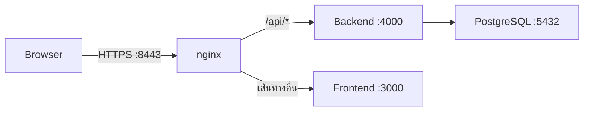

# ROPA

ระบบบันทึกและบริหารจัดการ **Record of Processing Activities** สำหรับติดตั้งใช้งานเอง (self-hosted) ตามแนวทาง GDPR มาตรา 30 และ PDPA ของไทย

รองรับการแบ่งข้อมูลตามหน่วยงาน ขั้นตอนอนุมัติ การกำหนดสิทธิ์ 2FA ไฟล์แนบ การแจ้งเตือน การสำรองข้อมูลอัตโนมัติ และ 3 ภาษา: ไทย อังกฤษ และจีน

## ภาพรวม

- บริหารรายการ ROPA แยกตามหน่วยงาน
- ส่งรายการเพื่ออนุมัติ ตีกลับ และแก้ไขใหม่ได้
- ปรับบทบาทและสิทธิ์จากหน้าเว็บผ่าน Permission Matrix
- บังคับใช้ 2FA และ HTTPS กับทุกบัญชี
- แนบไฟล์ ส่งออก Excel/PDF และตรวจสอบ Audit Log ได้
- สำรองข้อมูลอัตโนมัติทุกคืน

## เริ่มต้นใช้งาน

### 1. เตรียมไฟล์ตั้งค่า

```bash
cp .env.example .env

# แก้ค่า Secret และ URL ใน root .env ให้เรียบร้อย แล้วจึงกระจายค่าไปแต่ละ workspace
npm run env:setup -- local
```

สร้าง Secret แยกกันทั้งสามค่า แล้วนำผลลัพธ์ไปใส่ใน active block ของ root `.env`:

```bash
openssl rand -base64 48 # ACCESS_TOKEN_SECRET
openssl rand -base64 48 # PRE_AUTH_TOKEN_SECRET
openssl rand -hex 32    # TOTP_ENCRYPTION_KEY
```

> **สำคัญ:** ห้ามเปลี่ยน `TOTP_ENCRYPTION_KEY` หลังมีผู้ใช้ผูก 2FA แล้ว เพราะ key นี้ใช้เข้ารหัส TOTP secret ในฐานข้อมูล การเปลี่ยน key โดยไม่มี migration จะทำให้รหัสจาก Authenticator เดิมใช้ไม่ได้ ผู้ดูแลต้อง reset 2FA และให้ผู้ใช้สแกน QR ใหม่

`env:setup` ใช้ root `.env` เป็น source of truth และสร้างไฟล์ปลายทางตามขอบเขตการใช้งาน:

- `backend/.env` — Prisma และ Backend API
- `frontend/.env` — Vite/SvelteKit

root `.env` และไฟล์ที่สร้างทั้งหมดถูก Git ignore ห้าม commit ลง repository ส่วน `.env.example` เก็บได้เพราะมีเฉพาะค่าตัวอย่าง

### 2. เริ่มระบบด้วย Docker Compose

```bash
docker compose pull
docker compose up -d --build --wait
```

<details>
<summary>ใช้งานด้วย Apple Container</summary>

ต้องติดตั้ง `container-compose` ก่อน แล้วจึงรันคำสั่งต่อไปนี้:

```bash
container-compose --file docker-compose.yml build
container-compose --file docker-compose.yml up -d --env-file .env
container list --all
```

</details>

### 3. เปิดหน้าเว็บ

เปิด [https://localhost:8443](https://localhost:8443) หรือพอร์ตที่กำหนดใน `PUBLIC_HTTPS_PORT`

ระบบสร้างใบรับรองแบบ self-signed ให้อัตโนมัติในการรันครั้งแรก เบราว์เซอร์จึงอาจแสดงคำเตือน สำหรับระบบที่เปิดใช้งานผ่านอินเทอร์เน็ตควรเปลี่ยนเป็นใบรับรองจาก CA เช่น Let's Encrypt

## บัญชีเริ่มต้นและ 2FA

บัญชีผู้ดูแลระบบเริ่มต้นกำหนดได้ใน `.env` โดยมีค่าเริ่มต้นดังนี้:

| รายการ | ค่าเริ่มต้น |
|---|---|
| อีเมล | `admin@ropa.local` |
| รหัสผ่าน | `ChangeMe123!` |

> **สำคัญ:** เปลี่ยนรหัสผ่านผู้ดูแลระบบทันทีหลังเข้าสู่ระบบครั้งแรก

ทุกบัญชีต้องเปิดใช้ TOTP ซึ่งรองรับแอปอย่าง Google Authenticator และ Authy ผู้ใช้ที่ยังไม่ตั้งค่าจะถูกนำไปสแกน QR หลังกรอกรหัสผ่านถูกต้อง

- รหัสลับ TOTP เข้ารหัสด้วย AES-256-GCM ก่อนจัดเก็บ
- รหัสสำรองมี 10 ชุด แต่ละชุดใช้ได้ครั้งเดียว แสดงเพียงครั้งเดียว และจัดเก็บเป็น Bcrypt Hash
- สร้างรหัสสำรองชุดใหม่ได้จากหน้าโปรไฟล์ โดยชุดเดิมจะถูกยกเลิกทันที
- การล็อกอินและยืนยันโค้ดมี Rate Limit เพื่อป้องกันการเดารหัส
- ผู้มีสิทธิ์ `users.manage` สามารถรีเซ็ต 2FA ให้ผู้ใช้ตั้งค่าใหม่ในการเข้าสู่ระบบครั้งถัดไป

<details>
<summary>ข้อมูลที่ระบบสร้างให้อัตโนมัติในการรันครั้งแรก</summary>

- Migration และ Seed ของฐานข้อมูล
- สิทธิ์และบทบาทเริ่มต้น
- หน่วยงานสำนักงานส่วนกลาง, IT และ HR
- บัญชีผู้ดูแลระบบเริ่มต้น (Bootstrap Admin)

หน่วยงานทั้งหมดเพิ่มหรือแก้ไขภายหลังได้จากหน้า **หน่วยงาน**

</details>

## บทบาท สิทธิ์ และขั้นตอน ROPA

### บทบาทเริ่มต้น

| บทบาท | สิทธิ์โดยสรุป |
|---|---|
| Super Admin | จัดการทุกส่วนของระบบ |
| DPO | ดูและแก้ไข ROPA ทุกหน่วยงาน อนุมัติ ตีกลับ และดูประวัติการใช้งาน |
| Department Editor | สร้าง แก้ไข และส่ง ROPA ของหน่วยงานตนเองเพื่อขออนุมัติ |
| Viewer / Auditor | ดู ROPA ทุกหน่วยงานและประวัติการใช้งานแบบอ่านอย่างเดียว |

สร้างบทบาทใหม่หรือแก้ไขสิทธิ์ได้จากหน้า **บทบาทและสิทธิ์** โดยไม่ต้องแก้โค้ด

### Permission Matrix

สิทธิ์อยู่ในรูปแบบ `module.action` เช่น `ropa.read_own`, `ropa.read_all`, `ropa.approve` และ `users.manage` โดยผูกกับบทบาทผ่านตาราง `role_permissions`

ผู้ใช้มีหนึ่งบทบาทและอาจสังกัดหน่วยงาน สิทธิ์ที่ลงท้ายด้วย `_own` จำกัดข้อมูลเฉพาะหน่วยงานของผู้ใช้ ส่วน `_all` ครอบคลุมทุกหน่วยงาน

รายการสิทธิ์และบทบาทเริ่มต้นอยู่ที่ `backend/src/constants/permissions.ts`

### ขั้นตอนการอนุมัติ

```text
แบบร่าง (DRAFT) → รออนุมัติ (SUBMITTED) → อนุมัติแล้ว (APPROVED)
                              └──────→ ตีกลับ (REJECTED) → แก้ไขใหม่
```

Department Editor เป็นผู้สร้าง แก้ไข และส่งรายการ ส่วนผู้มีสิทธิ์ `ropa.approve` เช่น DPO เป็นผู้อนุมัติหรือตีกลับพร้อมเหตุผล

ระบบบันทึกทุกการกระทำลง Audit Log พร้อมแสดงค่าก่อนและหลังของแต่ละฟิลด์ ผู้มีสิทธิ์ `ropa.create` ยังสามารถทำสำเนารายการเดิมเป็นแบบร่างใหม่ได้

### ไฟล์แนบและการแจ้งเตือน

รองรับ PDF, Word, Excel, CSV/TXT และรูปภาพ ขนาดสูงสุดกำหนดด้วย `MAX_UPLOAD_SIZE_MB` ซึ่งมีค่าเริ่มต้น 10 MB

ไฟล์จะใช้ชื่อที่ระบบสุ่มและดาวน์โหลดเป็น `application/octet-stream` เสมอ การอัปโหลดและลบทำได้เมื่อรายการเป็นแบบร่างหรือถูกตีกลับ เว้นแต่ผู้ใช้มีสิทธิ์ `ropa.update_all`

เมื่อส่งรายการ ผู้มีสิทธิ์อนุมัติจะได้รับการแจ้งเตือน เมื่ออนุมัติหรือตีกลับ ผู้สร้างจะได้รับแจ้งเช่นกัน ระบบจะไม่ส่งการแจ้งเตือนให้ผู้กระทำรายการเอง

### ส่งออก Excel และ PDF

ผู้มีสิทธิ์ `ropa.export` สามารถกรองตามหน่วยงาน สถานะ และช่วงวันที่ แล้วส่งออกเป็น:

- Excel (`.xlsx`) ซึ่งมีข้อมูลครบทุกฟิลด์
- PDF ซึ่งสรุปจำนวนตามสถานะและตารางรายการ

ระบบยังคงบังคับสิทธิ์การอ่านขณะส่งออก ผู้ที่ไม่มี `ropa.read_all` จะส่งออกได้เฉพาะหน่วยงานของตนเอง

ข้อมูล Excel ป้องกัน Formula Injection (CWE-1236) โดยเติม `'` หน้าข้อความที่ขึ้นต้นด้วย `=`, `+`, `-` หรือ `@`

## สถาปัตยกรรมและเทคโนโลยี



| ส่วนประกอบ | เทคโนโลยี |
|---|---|
| Frontend | SvelteKit 5, Tailwind CSS v4, SSR และ Dark Mode |
| Backend | Node.js, Express, TypeScript และ Prisma ORM 7 |
| Database | PostgreSQL |
| Reverse Proxy | nginx |
| Runtime | Docker Compose หรือ Apple Container |
| Monorepo | npm Workspaces และ Turborepo |

- nginx ยุติการเชื่อมต่อ TLS และเปลี่ยน HTTP พอร์ต 8080 ไปยัง HTTPS
- Cookie ถูกกำหนดเป็น `Secure` การเข้าสู่ระบบใน Production จึงต้องทำผ่าน HTTPS
- Browser ติดต่อระบบผ่าน nginx เพียง Origin เดียว จึงไม่ต้องตั้งค่า CORS ใน Production
- SSR เรียก Backend ผ่านเครือข่ายภายในและส่งต่อ Cookie ด้วย `frontend/src/lib/server/backend.ts`
- Client เรียก `/api/*` ผ่าน `frontend/src/lib/api/client.ts` ซึ่ง Refresh Access Token เมื่อได้รับสถานะ 401

## การพัฒนาและโครงสร้างโปรเจกต์

### จัดการ Environment

เก็บค่าหลักไว้ใน root `.env` โดยเปิดไว้เพียงหนึ่ง Environment block แล้วใช้คำสั่ง `env:setup` สร้าง `backend/.env` และ `frontend/.env`:

| Profile | Source ที่ root | `NODE_ENV` ใน Backend |
|---|---|---|
| `local` | block ที่มี `APP_ENV=local` | `development` |
| `qa` | block ที่มี `APP_ENV=qa` | `production` |
| `stg` | block ที่มี `APP_ENV=stg` | `production` |
| `prod` | block ที่มี `APP_ENV=prod` | `production` |

เริ่มจากคัดลอกไฟล์ตัวอย่าง จากนั้น comment block ที่ไม่ได้ใช้และเปิดไว้เฉพาะ block ปัจจุบัน:

```bash
cp .env.example .env
```

```dotenv
# local (active)
APP_ENV=local
POSTGRES_DB=ropa
# ...

# qa (inactive)
# APP_ENV=qa
# POSTGRES_DB=ropa_qa
# ...
```

`APP_ENV` ใน root `.env` ต้องตรงกับ Environment ที่เลือก ถ้าไม่ตรง script จะหยุดก่อนเขียนไฟล์ ป้องกันการนำค่า local ไปสร้างเป็น qa, stg หรือ prod โดยไม่ตั้งใจ

รันโดยไม่ระบุ profile เพื่อเปิดเมนูเลือก Environment ระบบจะแสดง profile ปัจจุบัน สร้างไฟล์ตามตัวเลือก แล้วถามว่าจะเปิดแอปต่อทันทีหรือไม่:

```bash
npm run env:setup
```

```text
██████╗  ██████╗ ██████╗  █████╗
██╔══██╗██╔═══██╗██╔══██╗██╔══██╗
██████╔╝██║   ██║██████╔╝███████║
██╔══██╗██║   ██║██╔═══╝ ██╔══██║
██║  ██║╚██████╔╝██║     ██║  ██║
╚═╝  ╚═╝ ╚═════╝ ╚═╝     ╚═╝  ╚═╝
Environment Setup  •  local / qa / stg / prod

Current environment: local
1) current (local)
2) local
3) qa
4) stg
5) prod
Select environment [1]:
Start app? [y/N]:
```

เลือก `current` หรือกด Enter เพื่อใช้ `APP_ENV` จาก block ที่เปิดอยู่ใน root `.env` จากนั้น script จะสร้าง `backend/.env` และ `frontend/.env` แล้วถามว่าจะเรียก `npm run dev` ต่อหรือไม่

สามารถระบุ profile โดยตรงสำหรับ automation หรือ CI ได้เช่นเดิม:

```bash
# อ่านค่าจาก Environment block ที่เปิดอยู่ใน root .env
npm run env:setup -- local

npm run env:setup -- current --force
npm run env:setup -- local --force --run
npm run env:setup -- qa
npm run env:setup -- stg
npm run env:setup -- prod
```

ก่อนเปลี่ยน Environment ให้ comment block เดิมและ uncomment block ใหม่ใน root `.env` แล้วรันคำสั่งของ Environment นั้น ค่า `APP_ENV`, Database, Origin, Secret และ Admin account จึงแยกจากกันอย่างชัดเจน

แก้ค่าใน root `.env` เช่น `PUBLIC_ORIGIN`, `BACKEND_ORIGIN`, `CORS_ORIGIN`, `POSTGRES_*` หรือ `DATABASE_URL` แล้วรันคำสั่งอีกครั้ง ถ้าระบุ `DATABASE_URL` script จะใช้ค่านั้นโดยตรง ถ้าไม่ระบุจะประกอบ URL จาก `POSTGRES_USER`, `POSTGRES_PASSWORD`, `POSTGRES_DB`, `POSTGRES_HOST` และ `DATABASE_PORT` โดย fallback ไปใช้ `POSTGRES_HOST_PORT`

ถ้า Apple Container publish พอร์ต PostgreSQL แล้ว DB client พบ `ECONNRESET` หรือ `No route to host (os error 65)` ให้ตรวจ system log ก่อน:

```bash
container system logs --last 5m | grep -E 'No route to host|connect failed'
```

ถ้า log ระบุว่า forwarder ต่อเข้า subnet ของ container ไม่ได้ ให้เปิด **System Settings → Privacy & Security → Local Network** สำหรับ Container และ DB client หากมีชื่อแสดงอยู่ในรายการ หากยังไม่หาย ให้ยกเว้นเฉพาะ subnet ของ network `database` ตามแนวทาง Local Network Privacy ของ Apple แล้ว restart เครื่อง:

```bash
sudo defaults write com.apple.network.local-network AllowedEthernetLocalNetworkAddresses -array-add '192.168.64.0/18'
sudo defaults write com.apple.network.local-network AllowedWiFiLocalNetworkAddresses -array-add '192.168.64.0/18'
sudo reboot
```

หลังเครื่องกลับมา ให้เริ่ม PostgreSQL และตรวจผ่าน Prisma ซึ่งทดสอบ protocol จริง ไม่ใช่แค่ตรวจว่า TCP port เปิดอยู่:

```bash
container system start
container-compose --file docker-compose.yml up -d postgres
npm --workspace backend exec prisma migrate status
```

สำหรับ local development ให้ Backend และ DB client ต่อผ่าน published port:

```dotenv
POSTGRES_HOST=localhost
DATABASE_PORT=5433
POSTGRES_HOST_PORT=5433
```

`DATABASE_PORT` คือพอร์ตที่ Backend ใช้ต่อฐานข้อมูล ส่วน `POSTGRES_HOST_PORT` คือพอร์ตที่ Compose publish บนเครื่อง ช่วง `192.168.64.0/18` ครอบคลุม subnet `/24` แบบ dynamic ที่ Apple Container แจกตั้งแต่ `192.168.64.x` ถึง `192.168.127.x`; ตรวจ subnet ปัจจุบันได้ด้วย `container network inspect database`

script จะไม่แก้ root `.env` และไม่เขียนทับไฟล์ปลายทางเดิม หากต้องการสร้าง `backend/.env` และ `frontend/.env` ใหม่ให้ใช้ `--force`:

```bash
npm run env:setup -- stg --force
```

> **สำคัญ:** `--force` เขียนทับเฉพาะ `backend/.env` และ `frontend/.env` script จะไม่สลับหรือแก้ block ใน root `.env` ให้

### รันในเครื่อง

```bash
# ติดตั้ง dependencies ของทั้ง workspace จาก root
npm install

# สร้าง Backend และ Frontend Environment จาก root .env
npm run env:setup -- local

# PostgreSQL
docker compose up -d postgres

# Database และข้อมูลตั้งต้น
npm run prisma:migrate
npm run seed

# เปิด Backend และ Frontend พร้อมกันผ่าน Turborepo TUI
npm run dev

# ใช้ log แบบ stream เมื่อ terminal ไม่รองรับ TUI
npm run dev:stream
```

`npm run dev` ไม่เรียก `prisma:generate` อัตโนมัติ ถ้าติดตั้ง dependencies ใหม่ อัปเดต Prisma หรือแก้ `backend/prisma/schema.prisma` ให้รันคำสั่งนี้ก่อน:

```bash
npm run prisma:generate
```

- Backend: [http://localhost:4000](http://localhost:4000)
- Frontend: [http://localhost:5173](http://localhost:5173) โดย Proxy `/api` ไปยัง Backend

<details>
<summary>ดูโครงสร้างโปรเจกต์</summary>

```text
package.json                    npm workspace และคำสั่งระดับ monorepo
package-lock.json               lockfile เดียวของทั้ง workspace
turbo.json                      task graph และ cache outputs
backend/
  prisma/schema.prisma          โมเดลข้อมูลหลัก
  src/modules/                  Auth, Users, Roles, Departments, ROPA, Audit และ Notifications
  src/middleware/               Authentication, Permission, Pre-auth และ Rate Limit
  src/utils/                    TOTP, Backup Codes, Export และ Diff
  src/db/seed/                  ข้อมูลตั้งต้นของระบบ
  src/__tests__/                ชุดทดสอบ Vitest และ Supertest
frontend/
  src/routes/(app)/             หน้าสำหรับผู้ใช้ที่เข้าสู่ระบบแล้ว
  src/routes/login/             Login และขั้นตอน 2FA
  src/lib/i18n/                 คำแปลภาษาไทย อังกฤษ และจีน
  src/lib/components/           UI Components และฟอร์ม ROPA
nginx/
  nginx.conf                    การตั้งค่าหลัก
  templates/default.conf.template
.github/workflows/              CI/CD และ Claude Review
```

</details>

## ความปลอดภัยและเอกสารเพิ่มเติม

ทุก Push และ Pull Request จะผ่านการตรวจ Secret, Build, Type Check, Dependency Audit, CodeQL, Trivy และการรีวิว Diff อัตโนมัติ

- [CI-CD.md](CI-CD.md) — รายละเอียดไปป์ไลน์ CI/CD
- [SECURITY.md](SECURITY.md) — มาตรการความปลอดภัยและการรายงานช่องโหว่
- [CREDITS.md](CREDITS.md) — แหล่งที่มาและไลบรารีที่ใช้งาน
