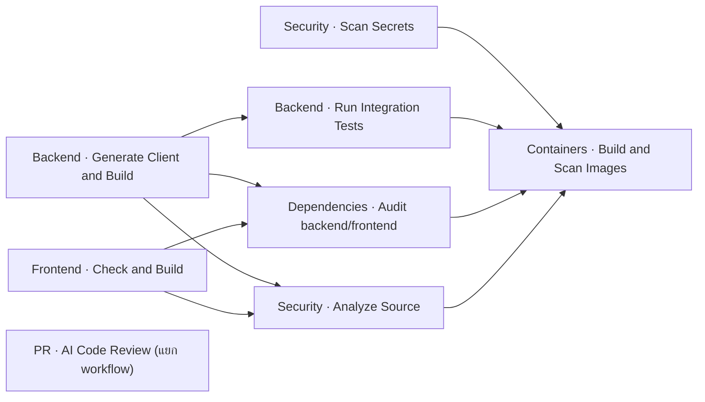

# CI/CD ของ ROPA

เอกสารนี้อธิบาย workflow ที่รันจริงจาก
`.github/workflows/ci.yml` และ `.github/workflows/claude-review.yml` โดยเน้นว่า
แต่ละขั้นตอนทำอะไร รันเมื่อใด และชื่อที่เห็นใน GitHub Actions สื่อความหมายอย่างไร

## Workflow และ trigger

| ไฟล์                | ชื่อที่แสดงใน GitHub             | Trigger                                                 | หน้าที่                                                       |
| ------------------- | -------------------------------- | ------------------------------------------------------- | ------------------------------------------------------------- |
| `ci.yml`            | `CI · Build, Test, and Security` | push และ pull request ที่เข้า `main` หรือ `develop`     | build, test และ security gates หลัก                           |
| `claude-review.yml` | `PR · AI Code Review (Claude)`   | pull request ที่เปิดใหม่ มี commit เพิ่ม หรือเปิดกลับมา | รีวิว diff ด้าน security และ correctness แล้วเขียน PR comment |

CI ใช้ concurrency group ตาม workflow และ Git ref หาก push commit ใหม่เข้ามาใน ref
เดิม run เก่าจะถูกยกเลิกเพื่อลดเวลารอและค่าใช้จ่าย

## มาตรฐานการตั้งชื่อ

ชื่อเดิมอ่านพอเข้าใจ แต่ `CI` สั้นเกินไป หลาย step ไม่มีชื่อ และ job ใช้รูปแบบ
ไม่สม่ำเสมอ จึงปรับเป็นกติกาเดียวกันดังนี้

- Workflow: ระบุชนิดและผลลัพธ์หลัก เช่น `CI · Build, Test, and Security`
- Job ID ใน YAML: ใช้ `kebab-case` และคงที่เพื่อให้อ้างใน `needs` ได้ง่าย เช่น
  `backend-build`
- Job display name: ใช้รูปแบบ `ขอบเขต · การกระทำ` เช่น
  `Backend · Run Integration Tests`
- Step: ใช้คำกริยาที่บอกสิ่งที่เกิดขึ้นจริง เช่น `Generate Prisma Client`
- Matrix job: ใส่ค่าของ matrix ในชื่อ เช่น `Dependencies · Audit backend`

เครื่องหมาย `·` แยกขอบเขตออกจากการกระทำชัดเจนโดยไม่ทำให้ชื่อยาวเกินไป และ
ทุกชื่อยังอ่านได้เมื่อแสดงใน required status checks

## ลำดับการทำงาน



Wave แรกเริ่มงานที่เร็วและเป็นอิสระพร้อมกัน Wave ที่สองรันการตรวจเชิงลึกหลัง
build ผ่าน และ Wave สุดท้าย build image จริงเมื่อ gates ก่อนหน้าผ่านทั้งหมด
ส่วน AI review แยก workflow เพื่อไม่ให้ secret หรือผู้ให้บริการภายนอกขัดขวาง CI หลัก

## แต่ละ job ทำอะไร

| Job ID            | ชื่อที่แสดง                             | ขั้นตอนสำคัญ                                                               | เงื่อนไขที่ทำให้ไม่ผ่าน                                                                  |
| ----------------- | --------------------------------------- | -------------------------------------------------------------------------- | ---------------------------------------------------------------------------------------- |
| `secret-scan`     | `Security · Scan Secrets (gitleaks)`    | checkout Git history ทั้งหมดแล้วสแกนด้วย Gitleaks                          | พบ secret, token หรือ private key ที่ตรงกฎ                                               |
| `backend-build`   | `Backend · Generate Client and Build`   | `npm ci`, generate Prisma Client v7, TypeScript build                      | lockfile ติดตั้งไม่ได้, generate ไม่ได้ หรือ type-check ไม่ผ่าน                          |
| `frontend-build`  | `Frontend · Check and Build`            | `npm ci`, `svelte-check`, Vite production build                            | Svelte/TypeScript error หรือ build ไม่ผ่าน                                               |
| `backend-test`    | `Backend · Run Integration Tests`       | เปิด PostgreSQL 18 service, apply migrations, seed และรัน Vitest/Supertest | migration หรือ integration test ใด ๆ ไม่ผ่าน                                             |
| `dependency-scan` | `Dependencies · Audit backend/frontend` | รัน matrix แยก backend และ frontend ด้วย `npm audit --audit-level=high`    | พบช่องโหว่ระดับ high หรือ critical                                                       |
| `sast-codeql`     | `Security · Analyze Source (CodeQL)`    | วิเคราะห์ JavaScript/TypeScript ด้วย CodeQL                                | CodeQL รันไม่สำเร็จหรือ policy ของ repository ปฏิเสธผลลัพธ์                              |
| `docker-scan`     | `Containers · Build and Scan Images`    | build backend/frontend image แล้วสแกนด้วย Trivy                            | image มีช่องโหว่ high/critical; filesystem misconfiguration เป็นข้อมูลประกอบและไม่ block |
| `claude-review`   | `Review · Security and Correctness`     | อ่าน diff และ `CLAUDE.md` แล้วเขียนสรุปลง PR                               | เป็น advisory job และไม่ควรตั้งเป็น required check                                       |

## Prisma v7 ใน CI

Prisma v7 อ่าน datasource จาก `backend/prisma.config.ts` และต้องมี
`DATABASE_URL` ขณะประเมิน config แม้คำสั่ง `prisma generate` จะยังไม่เชื่อมฐานข้อมูล
ดังนั้น `backend-build` กำหนด URL สำหรับ generate โดยเฉพาะ ส่วน `backend-test`
ใช้ URL ของ PostgreSQL service จริง

Generated client อยู่ที่ `backend/src/generated/prisma` และไม่ commit เข้า Git
ทุก environment ต้องรัน `npm run prisma:generate` ก่อน build หลังแก้ schema
runtime เชื่อม PostgreSQL ผ่าน `@prisma/adapter-pg`

## Permissions และ supply-chain controls

- Workflow หลักเริ่มด้วย `contents: read`; CodeQL เพิ่มเฉพาะ
  `security-events: write` ใน job ที่ต้องใช้
- AI review มีเฉพาะสิทธิ์อ่าน source และเขียน PR/issue comment
- GitHub Actions และ third-party Actions ถูก pin ด้วย full commit SHA พร้อม comment
  บอก release tag เพื่อให้ตรวจสอบง่ายและไม่รับโค้ดใหม่โดยไม่ตั้งใจ
- Gitleaks และ Trivy ระบุเวอร์ชัน ไม่ใช้ scanner image แบบ `latest`
- เมื่ออัปเดต Action ให้ตรวจ release notes, resolve tag เป็น SHA ใหม่ แล้วรัน CI ทั้งชุด

## Required checks และ branch protection

สำหรับ `main` และ `develop` ให้เปิด **Require a pull request before merging**,
**Require review from Code Owners** และเลือก checks ต่อไปนี้เป็น required:

- `Security · Scan Secrets (gitleaks)`
- `Backend · Generate Client and Build`
- `Frontend · Check and Build`
- `Backend · Run Integration Tests`
- `Dependencies · Audit backend`
- `Dependencies · Audit frontend`
- `Security · Analyze Source (CodeQL)`
- `Containers · Build and Scan Images`

ชื่อ job ถูกปรับจากของเดิม จึงต้องอัปเดต required status checks ใน repository
settings หลัง merge ครั้งแรก ส่วน `Review · Security and Correctness` ให้คงเป็น advisory

## ตั้งค่า AI review

สร้าง repository secret ชื่อ `ANTHROPIC_API_KEY` ที่
**Settings → Secrets and variables → Actions** หากใช้ subscription token ให้เปลี่ยน
input ของ action เป็น `CLAUDE_CODE_OAUTH_TOKEN` ตามเอกสาร release ที่ pin ไว้
หากไม่มี secret job นี้จะไม่สามารถเขียน review แต่ไม่กระทบ dependency graph ของ CI หลัก

## รัน checks ในเครื่อง

```bash
# Backend generate และ build
cd backend
cp .env.example .env
npm ci
npm run prisma:generate
npm run build

# Backend integration tests (ต้องมี PostgreSQL ตาม DATABASE_URL ใน .env.test)
npm test

# Frontend
cd ../frontend
npm ci
npm run check
npm run build

# Dependency audit
cd ../backend && npm audit --audit-level=high
cd ../frontend && npm audit --audit-level=high
```

Docker/Trivy checks ควรรันผ่าน workflow หรือ Docker-compatible runtime เพราะต้อง build
image จริง การผ่าน build ในเครื่องไม่ทดแทน image scan
